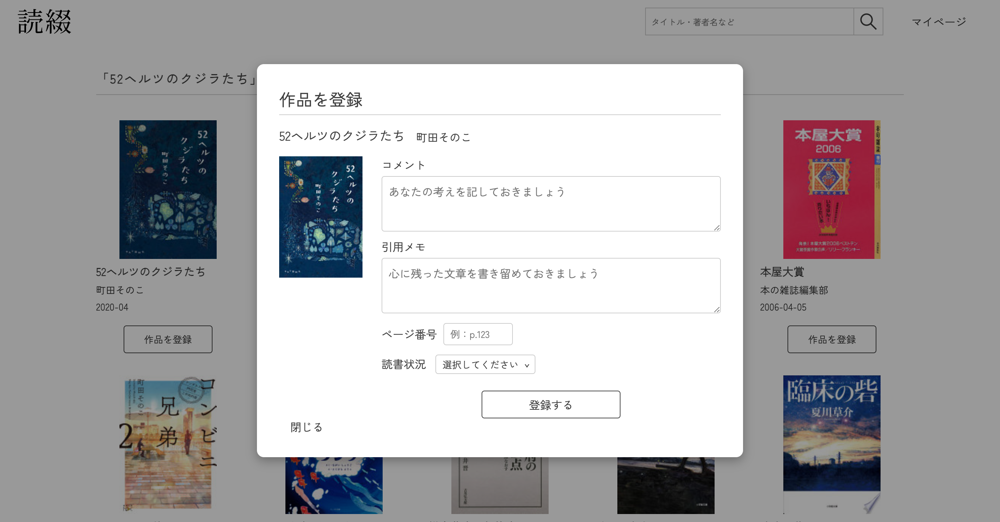
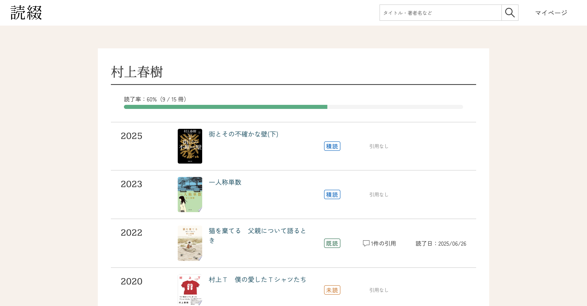
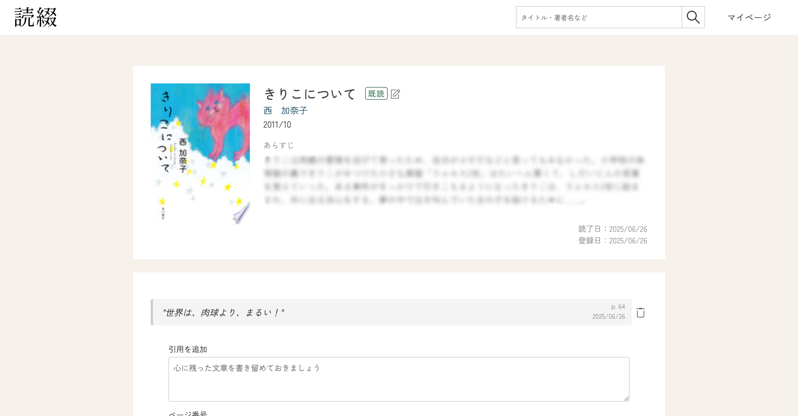
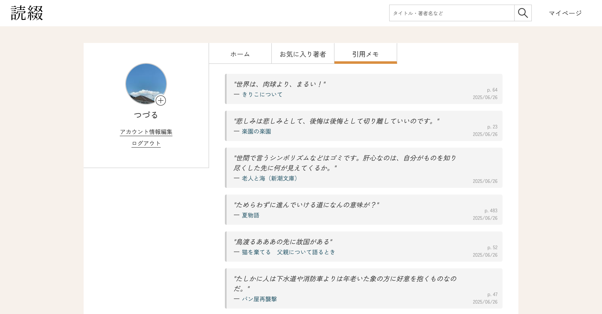

# 読綴 -Yomitsuzuri-
著者単位で読書ログを整理できる、読書記録Webアプリです。  
Google Books APIを用いた作品検索、読書状況の管理、著者ごとの作品年表の表示などを実装しています。  
スマートフォンからもご確認いただけます。  

## 機能紹介

|   |   |
|-----------|-----------|
| **作品を検索してマイページに登録**  | **著者ごとの作品年表・読了率**  |
| **感じたことや心に残った引用を作品ページで登録**  | **登録した引用を一覧で振り返る**  |

## 使用技術
| カテゴリ | 技術スタック |
| --- | --- |
| フレームワーク | Ruby on Rails 7.1.5.1 |
| バックエンド | Ruby 3.4.3 / Rails |
| フロントエンド | HTML / SCSS / JavaScript (ES6, Turbo) |
| DB | MySQL |
| 認証機能 | Devise |
| API | Google Books API |
| 開発環境 | ローカル (Mac + VSCode) |
| デプロイ環境 | 未定（ローカル開発中） |

## 機能一覧
#### ユーザー認証 (Devise)
- 新規登録 / ログイン / ログアウト / パスワード再設定

#### 書籍検索・登録 (Google Books API)
- 

#### アバター画像アップロード (Active Storage + image_processing (MiniMagick))
- active_storage_validation

#### レスポンシブ対応
- モバイルファースト + BEM設計

## ER図

## 今後の実装予定
- 著者プロフィール記載（MediaWiki API導入）
- 検索結果における作品数増加
- お気に入り著者を任意の順に並び替え
- 本番環境へのデプロイ（Render予定）