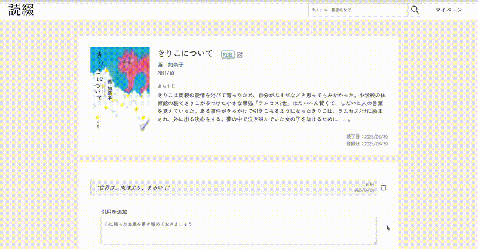

# 読綴 -Yomitsuzuri-
著者単位で読書ログを整理できる、読書記録Webアプリです。  
Google Books APIを用いた作品検索、読書状況の管理、著者ごとの作品年表の表示などを実装しています。  
スマートフォンからもご確認いただけます。  

#### テスト用アカウント
メールアドレス：  
パスワード：

## ターゲットユーザー
- 好きな著者の作品を辿って制覇したい人
- SNS機能を必要とせず、自分だけのために読書記録をつけたい人

## 主な機能
| 本を検索 | 本を登録 |
|-----------|-----------|
|  |  |

| 著者をお気に入りに登録 | 著者ページ |
| --- | --- |
|  |  |

| 引用を追加 | 引用を一覧で振り返る |
| --- | --- |
|  |  |

## 使用技術
| カテゴリ | 技術スタック |
| --- | --- |
| フレームワーク | Ruby on Rails 7.1.5.1 |
| バックエンド | Ruby 3.4.3 / Rails |
| フロントエンド | HTML / SCSS / JavaScript (ES6, Turbo) |
| DB | PostgreSQL |
| 認証機能 | Devise |
| API | Google Books API |
| インフラ | Heroku |
| 開発環境 | Mac + VSCode + Rails + PostgreSQL |

## 技術選定・構成の背景

- 当初はMySQLを使用していたが、Herokuへのデプロイに合わせてPostgreSQLに切り替え
- 今後のクラウド運用を想定し、Herokuで公式サポートされている構成に統一

## 機能一覧
#### ユーザー認証 (Devise)
- 新規登録 / ログイン機能

#### 書籍検索・保存 (Google Books API)
- 検索にマッチした本の情報をDBに保存

#### 読書ログ登録・編集
- 本ごとに引用メモ・コメント・既読 / 未読 / 積読を登録
- 作品ページで読書ログを編集

#### 著者をお気に入りに登録
- お気に入りに登録した著者の本を年代順に表示・読了率表示

#### プロフィール画像アップロード (Active Storage + image_processing (MiniMagick))

## ER図

## 今後の実装予定
- 著者プロフィール記載（MediaWiki API導入）
- 検索結果における作品数増加
- お気に入り著者を任意の順に並び替え
- 本番環境へのデプロイ（Render予定）